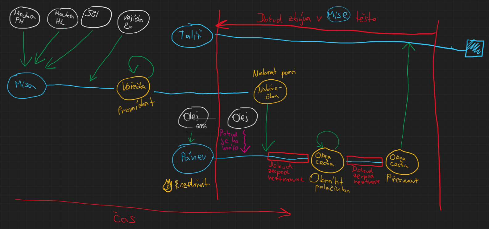
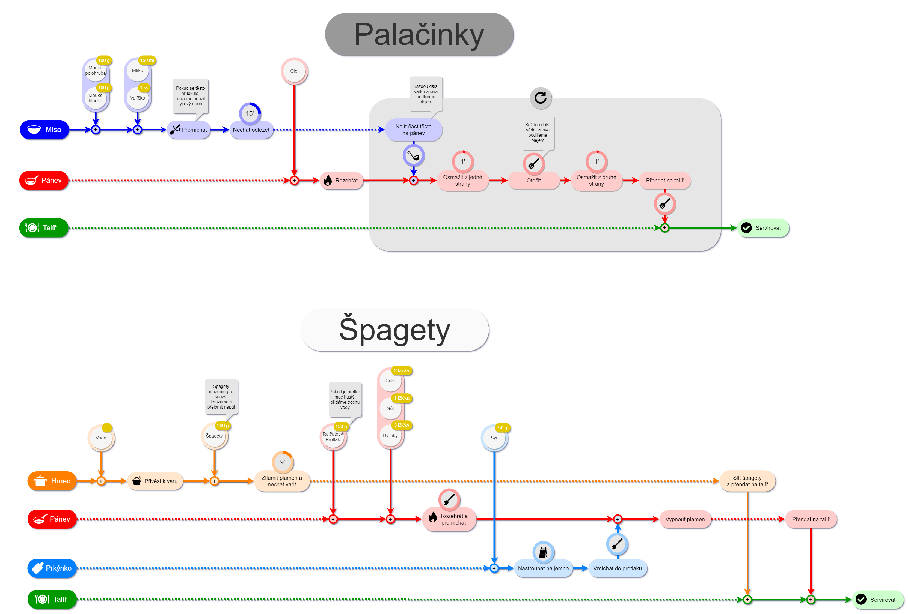

# Flow Cook
**A flow diagram based cooking recipe project**

---

This project strives to become a web application for sharing recipes in the form of easy to understand flow diagrams (not literal flow charts per se).

For some people (me including), common written cooking recipes are difficult to navigate in, especially in the heat of the moment, when they have to read into the recipe and lose focus on the actual deed.

The goal of this project is to establish a common cooking language and create easy to navigate diagrams. The key principle is knowing *where* on the timeline I am and exactly *what* comes next - all available at a glance.

Below is a first draft and a mock up created in draw.io of how the diagram should look and be structured.





So far, the approach has only been tested with simple recipes. I don't yet know how more difficult ones will manage.


## Project setup
```
npm install
```

### Compiles and hot-reloads for development
```
npm run serve
```

### Compiles and minifies for production
```
npm run build
```